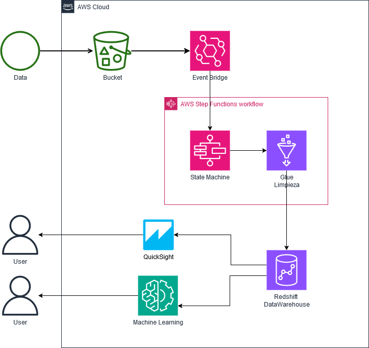
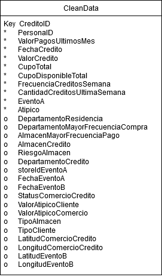
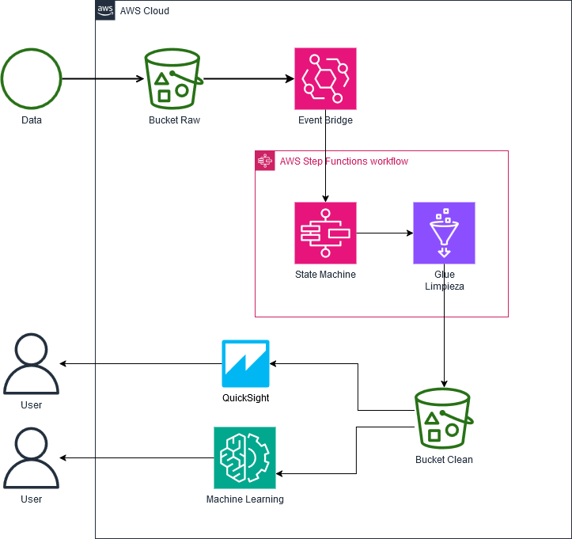

# Prueba tecnica Nequi para el cargo de Ingeniero de Datos

#### Desarrollo hecho por Ricardo Antonio Arango Quiroz
#### Medellin - Colombia, 11/01/2025

## Contexto de los datos y del desafio
En el mundo financiero actual, las instituciones están constantemente expuestas a riesgos asociados con actividades fraudulentas. Estas actividades no solo impactan a las entidades financieras, sino que también pueden comprometer la seguridad y confianza de los clientes y del sistema financiero en general.
Las transacciones atípicas son aquellas que se desvían significativamente de los patrones habituales de comportamiento. Estas pueden incluir desde transferencias de montos inusualmente grandes o pequeños hasta movimientos de dinero que no se alinean con el historial financiero de los usuarios. Detectar estas transacciones representa un gran desafío debido a la inmensa cantidad de datos que las instituciones financieras procesan diariamente y a la complejidad de los patrones que pueden sugerir actividad fraudulenta.
Por ello, existe una necesidad creciente de desarrollar métodos más avanzados para identificar transacciones sospechosas. Al comprender los factores que influyen en el comportamiento de los clientes y emplear herramientas avanzadas, es posible mejorar la precisión y eficiencia en la detección de actividades atípicas, fortaleciendo así la seguridad del sistema financiero.

El actual reto consiste en la limpieza y preparación de datos de transacciones atípicas para la construcción de modelos de Machine Learning que eficazmente puedan detectar estos. También los datos deben de ser útiles para la construcción de reportes de visualización que permitan a los analistas conocer el estado actual del negocio.

## Especificaciones de los datos
Los datos suministrados consisten en aproximadamente 1.7 millones de transacciones reales realizadas en un tiempo específico. Cada transacción representa la creación de un crédito por parte de un cliente. Los datos incluyen diversas variables descriptivas, como la fecha de la transacción, el ID del almacén donde se generó el crédito, características del cliente, y otras variables adicionales. Los datos se entregarán en formato .csv.

Dada la naturaleza del negocio, se debe esperar recibir nuevos registros diariamente a cualquier momento del dia.

## Diccionario de Datos
Lo siguiente muestra una explicacion para los campos de datos antes de entrar en el proceso de limpieza.

|VARIABLE|DEFINICIÓN|
|------|------|
|CreditoID|Código único para identificar un crédito|
|PersonaID|Código único para identificar un cliente|
|DepartamentoResidencia|Departamento de residencia del cliente, ingresado en el momento del enrolamiento|                         
|DepartamentoMayorFrecuenciaCompra|Moda del departamento de compra para cada cliente, es decir, el departamento donde más ha realizado compras|
|AlmacenMayorFrecuenciaPago|Moda del  Almacén de pago para cada cliente|       
|ValorPagosUltimosMes|Suma del total de pagos realizado por cada cliente en el último mes|
|AlmacenCredito|Código único para identificar al almacén donde se realiza el crédito|
|RiesgoAlmacen|Variable interna que identifica el grado de riesgo de un almacen (1: bajo, 7 medio, 9 alto)|
|DepartamentoCredito|Código del departamento del comercio donde se está realizando el crédito|
|FechaCredito|Fecha y hora en la que se crea el crédito|
|ValorCredito|Monto en pesos ($)  de la compra que se está realizando|                           
|CupoTotal|Cupo total  en pesos ($) que tiene el cliente justo antes de realizar la compra | 
|CupoDisponibleTotal|Cupo disponible en pesos ($) que tiene el cliente justo antes de realizar la compra (corresponde al cupo total -   monto de $ que tiene el cliente en el momento en uso)|
|storeIdEventoA|Código del almacén donde ocurrió el evento A|
|FechaEventoA|Fecha en la que sucedió el evento A|
|EventoA|Variable binaría, indica si sucedió el evento A|
|FechaEventoB|Fecha en la que sucedió el evento B|
|LocalizacionEventoB|Corresponde a la Latitud y Longitud del comercio donde se realizó el evento B|
|LocalizacionComercioCredito|Corresponde a la Latitud y Longitud del comercio donde se realiza el crédito|
|StatusComercioCredito|Codigo interno que permite identificar el estado del almacen, si está activo o inactivo|
|FrecuenciaCreditosSemana|Corresponde al calculo del promedio de créditos comprados por semana, calculado para las semanas en las que se ha realizado compras|
|CantidadCreditosUltimaSemana|Corresponde al conteo de los créditos sacados en la última semana|
|ValorAtipicoCliente|Variable calculada para medir cuando el valor de una transaccion es atípica para el monto comprado por un cliente|
|ValorAtipicoComercio|Variable calculada para medir cuando el valor de una transaccion es atípica para el monto vendido por el almacén|
|TipoAlmacen|Marcación de Fisico o virtual según el tipo de almacen donde se está realizando la compra|
|TipoCliente|Marcación de Antiguo o Nuevo, según el tipo de cliente que esta haciendo la transaccion|
|Atipico|Clasificación binaria, si una transacción fue considerada como atípica o no|

*Nota:* Los eventos A y B corresponden a sucesos poco frecuentes relacionados con una interacción del cliente en un comercio

## Pipeline construido
A continuación se muestra el pipeline objetivo.

Aquí, los datos son procesados en cuanto se reciben en S3. Mediante EventBridge se captura el evento de recepción de datos, con lo cual se invoca el Step Function encargado de orquestar los pasos necesarios.
En este pipeline, los datos se limpian mediante un ETL en AWS Glue para luego ser guardados en su respectiva tabla en AWS Redshift Serverless.

AWS S3 ha sido escogido como lugar de recepción de los datos, dado que estos serán manualmente ingresados después de que se han verificado como atípicos o no por parte del negocio. La captura de datos para este proyecto no se hace en vivo.
Anazon Redshift se ha escogido debido a su capacidad de soportar usuarios concurrentes consultando los mismos datos, ademas de su capacidad para manejar grandes volúmenes de datos estructurados, lo que sera útil a medida que estos aumenten en numero.

## Limpieza de datos

El proceso de limpieza es probablemente el mas complejo, a continuacion se van explicando los diferentes pasos:

#### Verificacion de valores nulos
Las columnas creditoid, personaid, fechacredito, valorcredito, cupototal, cupodisponibletotal no deben contener valores nulos.
Para las filas con valores nulos en la siguientes columnas se deben descartar pues presentan errores que no se pueden reparar.
- creditoid
- personaid
- fechacredito

Para las filas con valores nulos en las siguientes columnas se deben imputar con valor 0.
- valorcredito
- cupototal
- cupodisponibletotal
- FrecuenciaCreditosSemana
- CantidadCreditosUltimaSemana
- ValorPagosUltimosMes

En la columna EventoA, imputar los valores vacios con la palabra 'NO'

Otros valores nulos no suponen por ahora un mayor problema en el analisis de datos

#### Variable objetivo 'Atipico'
Esta variable solo admite los valores 0 y 1, otros valores se consideraran por ahora un error y seran eliminados.

#### Separación de datos de localizaciones
Las localizaciones de los comercios y los eventos son coordenadas GPS y vienen en la forma "latitud,longitud", estos se separan en dos columnas diferentes, una para latitud y otra para longitud.

## Modelo de datos después de limpieza
Respecto al modelo de datos inicial, ahora las columnas de localizacion han sido eliminadas y se tienen ademas las siguientes variables:

|VARIABLE|DEFINICIÓN|
|------|------|
|LatitudComercioCredito|Corresponde a la Latitud del comercio donde se realiza el crédito|
|LongitudComercioCredito|Corresponde a la Longitud del comercio donde se realiza el crédito|
|LatitudEventoB|Corresponde a la Latitud del comercio donde se realizó el evento B|
|LongitudEventoB|Corresponde a la Longitud del comercio donde se realizó el evento B|

## Otras perspectivas
- *Si los datos se incrementaran en 100x:* En este caso Redshift aun seguiria siendo util como datawarehouse, lo que si se deberia reconsiderar es el uso de AWS S3 y AWS Glue, se deben verificar si cumplen con estas nuevas cantidades.
- *Si las tuberías se ejecutaran diariamente en una ventana de tiempo especifica:* En este caso, desconectar AWS EventBridge de la arquitectura, y ejecutar AWS StepFunctions de forma programada en lugar de por eventos.
- *Si la base de datos necesitara ser accedido por más de 100 usuarios funcionales:* AWS Redshift puede manejar esto.
- *Si se requiere hacer analítica en tiempo real, ¿cuales componentes cambiaria a su arquitectura propuesta?:* Se replantea el uso de AWS Glue y se optaria por AWS EMR, ejecutando Apache Spark, el cual si es un sistema preparado para la analitica en tiempo real.

### Problemas en la conexion a redshift
Dados algunos problemas de conexion entre redshift y glue, esta es la arquitectura que funciona en este momento.

